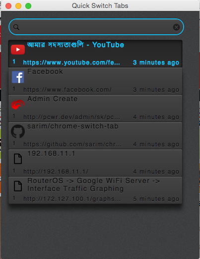

Chrome Quick Switch Tab
===

Creates a keyboard shortcut (Ctrl + Shift + T) to bring up a quick tab switch popup.
This extension is inspired from textmate's `Go To File` (cmd + T) popup.
This quick tab switch popup will show a list of currently opened tabs ordered by last access time. Also you can quickly search between open tabs and switch to it.

Usage
==

Press the hotkey and quick tab switch popup will appear.

You can search for a specefic tab, use up and down arrow for navigating then press enter to switch to that tab.

Shortcut Key
==

Default shortcut key is Ctrl + Shit + T, if it isn't working or you want to change the shortcut key, go to `chrome://extensions` and you'll find the `Keyboard shortcuts` setting dialog at the bottom of the page.